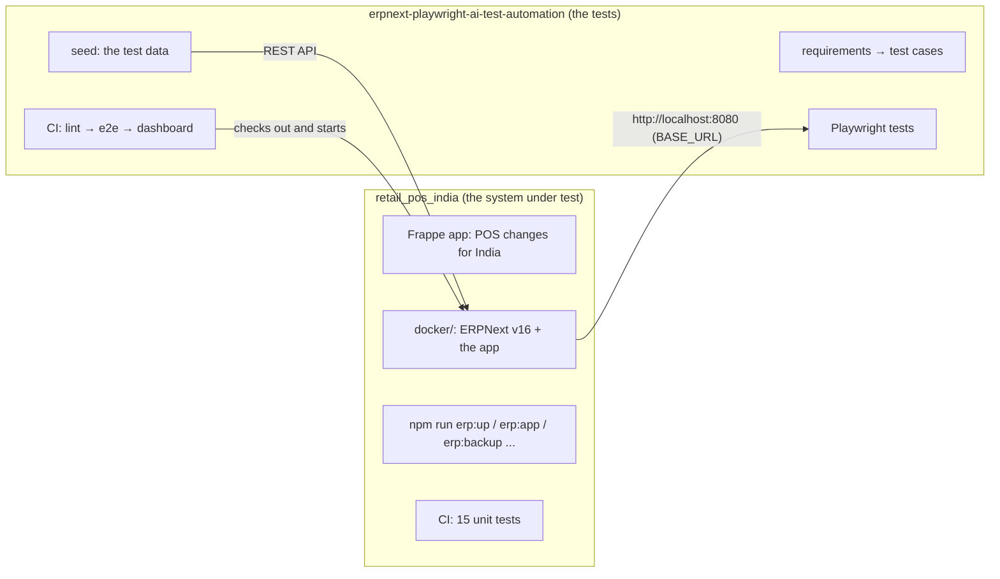
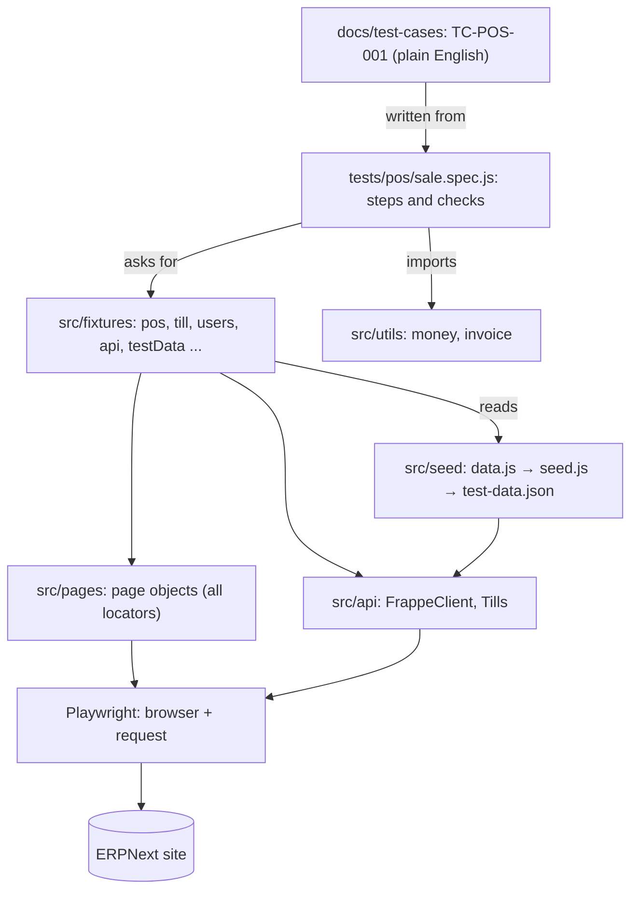
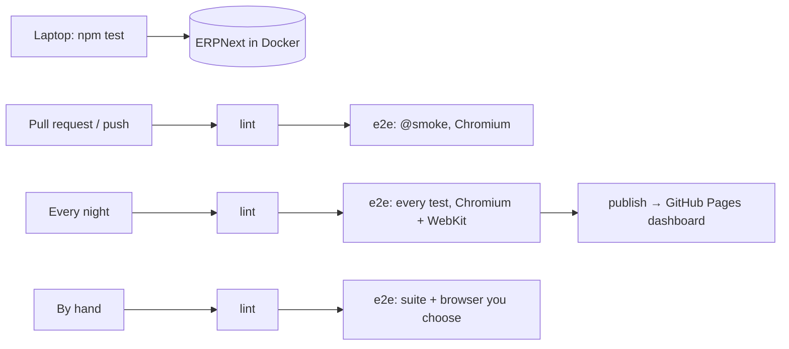
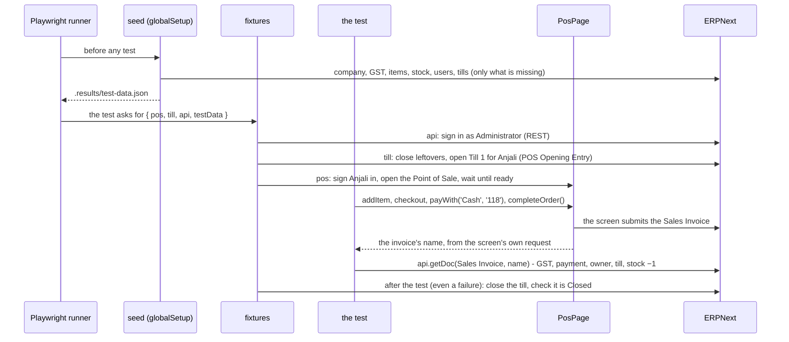

# The framework: structure, architecture, explanation

What this framework is made of, how the parts fit, how one test runs from start to end, and the
object-oriented ideas and design patterns in the code, each with an example from this repository.
The rules for writing tests are in [`CLAUDE.md`](../CLAUDE.md).

**Contents:** [1. Structure](#1-structure) · [2. Architecture](#2-architecture) ·
[3. How a test runs](#3-how-a-test-runs) · [4. OOP in the framework](#4-oop-in-the-framework) ·
[5. Design patterns](#5-design-patterns) · [6. Add a test](#6-add-a-test) ·
[7. How it scales](#7-how-it-scales) · [8. How AI is used, safely](#8-how-ai-is-used-safely)

---

## 1. Structure

```
erpnext-playwright-ai-test-automation/
│
├── docs/                          WHAT to test (people read these)
│   ├── requirements/              PRDs with requirement IDs (REQ-POS-012)
│   ├── test-cases/                test cases in plain English: steps + exact checks (TC-POS-001)
│   ├── test-data.md               every test value and worked GST totals
│   ├── framework.md               this page
│   ├── ai-workflow.md             the daily loop with the AI agent
│   └── ai-review-log.md           every AI mistake caught, and the rule it led to
│
├── tests/                         THE TESTS: steps and assertions only, one folder per feature
│   ├── access/sign-in.spec.js     TC-SIGNIN-001..005
│   └── pos/sale.spec.js           TC-POS-001..006
│
├── src/                           HOW the tests work (the framework code)
│   ├── fixtures/                  what a test can ask for by name, in three layers
│   │   ├── base.js                env, testData, users, api, session
│   │   ├── pages.js               loginPage, deskPage, posPage, secondDevice
│   │   ├── pos.js                 tills, till, pos, posWithoutTill
│   │   └── index.js               exports test, expect and the report helpers; table of fixtures
│   ├── pages/                     page objects: every locator lives here
│   │   ├── LoginPage.js           the sign-in screen
│   │   ├── DeskPage.js            any desk page
│   │   └── PosPage.js             the Point of Sale
│   ├── api/                       talking to ERPNext without a browser
│   │   ├── FrappeClient.js        REST client: read records by name, insert, call methods
│   │   └── tills.js               Tills: open and close a POS till (session)
│   ├── seed/                      the test data
│   │   ├── data.js                every value (company, GST, items, people, tills)
│   │   ├── seed.js                builds it on the site, safely re-runnable
│   │   ├── globalSetup.js         runs the seed before every test run
│   │   ├── run.js                 `npm run seed`
│   │   └── check.js               `npm run check`: is the site ready? (read-only)
│   └── utils/                     pure helpers specs may import
│       ├── money.js               rupees(118) → "₹ 118.00"; GST split of a price
│       └── invoice.js             payment rows, tax lines of a saved invoice
│
├── config/env.js                  base URL and credentials from .env
├── playwright.config.js           browsers (projects), timeouts, reporters, retries 0
├── reporting-labs.config.js       the HTML report: history, masking, links to requirements
├── eslint.config.js               the CLAUDE.md rules a machine can check (`npm run lint`)
│
├── .github/
│   ├── workflows/playwright-e2e.yml   CI: lint → ERPNext in Docker → seed → tests → dashboard
│   └── pull_request_template.md       checklist for every pull request
├── .claude/
│   ├── commands/                  reusable AI prompts: /test-cases /write-test /review-test /mutation-check
│   └── settings.json              hook: lint every file the AI agent edits
├── scripts/
│   ├── lint-edited-file.js        the hook's script
│   └── open-report.js             `npm run report`
├── CLAUDE.md / AGENTS.md          rules for AI agents (and people)
└── .env.example                   the local Docker site's address and passwords (copy to .env)
```

**Where does a new thing go?**

| New thing | Folder |
|---|---|
| A requirement | `docs/requirements/` |
| A test case | `docs/test-cases/<feature>.md` |
| A test | `tests/<feature>/<feature>.spec.js` |
| A screen | `src/pages/<Screen>Page.js` + a fixture in `src/fixtures/pages.js` |
| A user action on a screen | a method on that page object |
| Setup a test needs (open a till, a draft order...) | a fixture, using `src/api/` |
| A test value | `src/seed/data.js` and `docs/test-data.md` |
| A calculation a check needs | `src/utils/` |

---

## 2. Architecture

### The two repositories



The tests know only `BASE_URL` and the passwords in `.env`: they can point at any ERPNext site with
the app installed, and the seed builds the data there.

### The layers of the test framework



| Layer | Knows about | Never contains |
|---|---|---|
| **Test case** (docs) | the business: steps, values, expected results | code |
| **Spec** (tests/) | the test case's steps and checks, in code | locators, URLs, passwords, set-up code (the lint enforces it) |
| **Fixtures** | how to prepare and clean up what a test needs | assertions about the feature |
| **Page objects** | one screen: where things are, how a user acts on them | assertions, test data |
| **API** | ERPNext's REST endpoints | screens |
| **Seed** | the values every test relies on | tests |
| **Utils** | pure calculations | browser, server |

Each layer only calls the one below it. That is why a change in ERPNext's screen touches one page
object, not twenty tests.

### Where it runs



---

## 3. How a test runs

TC-POS-001, *a cashier sells one item for cash*, from start to end:



The same test, as written (`tests/pos/sale.spec.js`, shortened):

```js
test('TC-POS-001 a cashier sells one item for cash: GST included, booked as a POS sales invoice', { tag: ['@smoke'] }, async ({
  pos, till, api, testData,
}) => {
  const item = testData.items.stock
  const price = gstSplit(item)                       // 118 → net 100, CGST 9, SGST 9
  const stockBefore = await api.stockQty(item.code, testData.warehouse)

  await pos.addItem(item)
  await pos.checkout()
  await pos.payWith('Cash', String(price.gross))
  const sale = await pos.completeOrder()             // { name, accepted }

  const invoice = await api.getDoc('Sales Invoice', sale.name)   // read back BY NAME
  expect(invoice).toMatchObject({ is_pos: 1, docstatus: 1, grand_total: price.gross, owner: till.cashier })
  expect(await api.stockQty(item.code, testData.warehouse)).toBe(stockBefore - 1)
})
```

Three ideas make the tests reliable:

1. **Data is prepared, not clicked.** The seed and the fixtures set everything up through the API;
   only the screen under test is used through the browser.
2. **The server is the judge.** A test checks the record the server saved, by its name, not only
   what the screen shows.
3. **Everything opened is closed.** Fixtures clean up after every test, passed or failed.

---

## 4. OOP in the framework

JavaScript classes, used where they help: one class per screen and per service. Each idea below
points at real code.

### Class and object

A **class** is a blueprint; an **object** is one made from it. `PosPage` describes the Point of Sale
screen; the `posPage` fixture makes one object for the test's browser page:

```js
// src/pages/PosPage.js
class PosPage {
  constructor(page) {
    this.page = page
    this.search = page.getByRole('textbox', { name: 'Search by item code, serial number or barcode' })
    this.completeOrderButton = page.getByText('Complete Order', { exact: true })
    // ...
  }
  async addItem(item) { ... }
  async checkout() { ... }
}

// src/fixtures/pages.js
posPage: async ({ page }, use) => {
  await use(new PosPage(page))          // an object for THIS test's page
},
```

The second device in TC-SIGNIN-005 is a second object of the same classes, on another browser:
two `LoginPage` objects, each with its own page and cookies.

### Encapsulation

An object keeps its details inside and offers a few clear methods. A spec never sees a locator,
a URL or a request body: they are inside the page objects and the API client.

```js
// src/pages/PosPage.js: the spec calls completeOrder() and gets { name, accepted }.
// Inside, hidden from the spec: which request to wait for, the "Yes" confirmation, parsing the name.
async completeOrder() {
  const submit = this.page.waitForResponse(
    (r) => r.url().includes('/api/method/frappe.desk.form.save.savedocs') && (r.request().postData() || '').includes('action=Submit'),
  )
  await this.completeOrderButton.click()
  await this.page.getByRole('button', { name: 'Yes' }).click()
  const res = await submit
  const doc = JSON.parse(new URLSearchParams(res.request().postData()).get('doc'))
  return { name: doc.name, accepted: res.ok() }
}
```

`FrappeClient` marks its internal helpers with an underscore (`_json`, `_body`): they turn an
HTTP response into data or a readable error, and are not for callers.

The lint makes the encapsulation a rule: a spec that writes `page.locator(...)` or imports a page
object directly fails `npm run lint`.

### Abstraction

A method says **what** a user does and hides **how**. `payWith('UPI', '118')` reads like the test
case; the steps a cashier actually takes (set Cash to 0, select UPI, type on the number pad) are
inside:

```js
// src/pages/PosPage.js
async payWith(mode, keys) {
  if (mode !== 'Cash') {
    await this.selectMode('Cash')
    await this.typeAmount('0')
  }
  await this.selectMode(mode)
  await this.typeAmount(keys)
}
```

When ERPNext changed how a selected payment tile behaves, only `selectMode` changed; no test did.

The same at the API level: `tills.open({ till, user })` and `tills.close(opening)` hide a POS Opening
Entry, a POS Closing Entry and the payment reconciliation ERPNext requires.

### Composition ("has a")

Objects are built from other objects instead of inheriting from them:

- `PosPage` **has a** `LoginPage` to sign the cashier in:
  ```js
  async open(email, password) {
    await new LoginPage(this.page).signInThroughApi(email, password)
    await this.page.goto('/desk/point-of-sale')
  }
  ```
- `Tills` **has a** `FrappeClient` (passed in the constructor) and uses it for every request.
- The `secondDevice` fixture **has a** page, a `loginPage`, a `deskPage` and a `session`.

### Inheritance ("is a")

Used where it fits: the **fixtures**. Each layer extends the one before and adds to it, so `pos.js`'s
test has every fixture of `pages.js` and `base.js`:

```js
// src/fixtures/base.js
const test = base.test.extend({ env, testData, users, api, session })
// src/fixtures/pages.js
const test = base.extend({ loginPage, deskPage, posPage, secondDevice })
// src/fixtures/pos.js
const test = pages.extend({ tills, till, pos, posWithoutTill })
```

**Not** used for page objects: there is no `BasePage` class, on purpose. The three screens share
almost nothing (one `page` property), and a base class would only add a layer to read. Common
behaviour is shared by composition (`PosPage` uses `LoginPage`). A `BasePage` becomes worth it when
several page objects repeat the same code, for example a shared header or a common "wait until the
desk is ready".

### Polymorphism

The same code works with different objects that offer the same methods. `FrappeClient` wraps any
Playwright request context, and its methods behave the same whatever it wraps:

```js
// src/api/FrappeClient.js
static async signIn(baseUrl, user, password) { ... return new FrappeClient(ctx) }  // its own session
static fromContext(ctx) { return new FrappeClient(ctx) }                            // the browser's session
```

```js
// src/fixtures/base.js and pages.js
api:     await FrappeClient.signIn(ENV.baseUrl, ENV.adminUser, ENV.adminPassword)  // Administrator
session: FrappeClient.fromContext(page.request)                                    // this browser
secondDevice.session: FrappeClient.fromContext(page.request)                       // another browser
```

TC-SIGNIN-005 calls `session.sessionStatus()` and `secondDevice.session.sessionUser()`: the same
methods on two objects of one class, each answering for its own browser. JavaScript checks what an
object can do, not its declared type ("duck typing"), so anything with `get` and `post` would work.

### Static methods (factory methods)

`FrappeClient.signIn(...)` and `FrappeClient.fromContext(...)` are called on the class, not on an
object: they **create** a ready-to-use client. `signIn` also does the work a constructor cannot
(an `await`ed sign-in that may fail with a clear message).

### Getters

A getter reads like a property but is computed when used:

```js
// src/pages/PosPage.js
get openingRowCheckboxes() {
  return this.openingDialog.getByRole('checkbox').filter({ visible: true })
}
// the test: await expect(posWithoutTill.openingRowCheckboxes).toHaveCount(0)
```

### Single responsibility

Each class has one job: `LoginPage` signs in, `PosPage` sells, `FrappeClient` talks REST, `Tills`
opens and closes tills, `seed.js` prepares data. A change has one place to go.

---

## 5. Design patterns

| Pattern | Where | Why |
|---|---|---|
| **Page Object Model** | `src/pages/` | Locators and screen actions in one class per screen; tests read like test cases |
| **Fixtures = dependency injection** | `src/fixtures/` | A test names what it needs (`{ pos, api }`); Playwright builds it, hands it in and cleans it up. No set-up code in tests |
| **Factory** | `FrappeClient.signIn` / `fromContext`, the fixtures | Objects are created in one place, ready to use |
| **Facade** | `Tills` | One simple call (`open`, `close`) in front of several ERPNext documents and API calls |
| **Data builder (seed)** | `src/seed/` | Test data described once (`data.js`), built idempotently, shared by name |
| **Arrange, Act, Assert** | every spec | Fixtures arrange, page-object calls act, `expect` on the saved record asserts |
| **Layered architecture** | sections 1–2 | Each layer calls only the one below; changes stay local |

---

## 6. Add a test

1. A test case exists and is `Status: approved` (`/test-cases` drafts them from a PRD).
2. Any value it needs is in `src/seed/data.js` and `docs/test-data.md`.
3. A user action the page objects cannot do yet becomes a new method on the page object
   (locators from the real page's accessibility tree).
4. The spec: title = the test case heading, steps, checks by record name, one tag.
5. `npm run lint`, run it, break it once to see it fail (`/write-test` does all of this).

New screen: a new class in `src/pages/` and a fixture in `pages.js`. New feature area: a folder in
`tests/`, a test case file in `docs/test-cases/`, and, if it needs setup, a fixture file like `pos.js`.

---

## 7. How it scales

| Need | How |
|---|---|
| More tests | Same pattern; fixtures and page objects are shared, specs stay short |
| Faster runs | `WORKERS=n`. POS tests need **one till and cashier per worker** (a till has one open session, a cashier one device): add them to the seed and pick by `test.info().parallelIndex` |
| More browsers | Projects in `playwright.config.js` (Chromium and WebKit today) |
| Quick vs full | `@smoke` on every pull request; every test nightly, published to the [dashboard](https://sudhansushekhar.github.io/erpnext-playwright-ai-test-automation/) with the trend across runs |
| Another site | Change `BASE_URL`; the seed builds the data there |
| More people writing tests (or AI agents) | `CLAUDE.md` + the lint + the edit hook + CI: the same rules for everyone, checked by machines |

---

## 8. How AI is used, safely

| Practice | Where |
|---|---|
| Rules the agent reads first | `CLAUDE.md` (also `AGENTS.md` for other agents) |
| Reusable prompts for each step | `.claude/commands/`: `/test-cases`, `/write-test`, `/review-test`, `/mutation-check` |
| Human approval gates | test cases (`draft` → `approved`), test review, commit and push |
| Rules checked by machines, not memory | `npm run lint`, the edit hook (`.claude/settings.json`), CI |
| Proof a test can fail | the mutation check, for every new test |
| Learning from mistakes | `docs/ai-review-log.md`: each mistake → a rule or a lint check |
| Traceability | requirement → test case (coverage table) → test title → report (`meta({ story })`) |
| No secrets | only local Docker values in `.env`; reports mask passwords and payment details |
